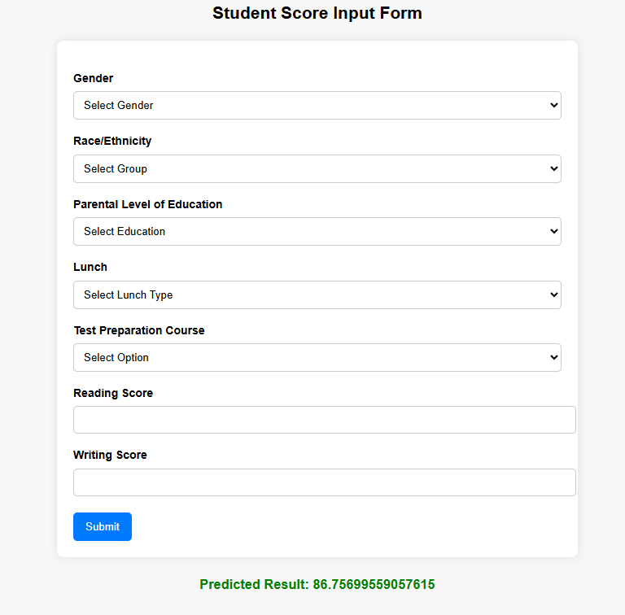

# Math Score Predictor using mlops

A web application that predicts a student’s **math score** based on personal and academic features using a machine learning pipeline. Built with **Flask**, containerized with **Docker**, and deployed on **AWS EC2**.

---

## 🔹 Features

- Predict math scores based on:
  - Gender
  - Race/Ethnicity
  - Parental level of education
  - Lunch type
  - Test preparation course
  - Reading & writing scores
- Web interface with interactive form
- REST API-ready backend
- Dockerized for easy deployment
- CI/CD enabled for automatic updates on EC2

## 🔹 Project Structure

math-score-predictor/
│
├─ dvc
├─ .github/
│ └─ workflows/
|    └─ ci-cd.yaml/
├─ artifacts/
├─ src/
│ └─ mlproject/
│ └─ pipeline/
│ └─ prediction_pipeline.py
├─ templates/
│ └─ home.html
├─ flask_app.py
├─ requirements.txt
├─ Dockerfile
├─ app.py
├─ main.py
├─ setup.py
├─ .gitignore
└─ README.md

## 🔹 Installation (Local)

1. Clone the repo:
git clone hhttps://github.com/srinu-nayak/math-score-predictor
cd math-score-predictor

2. Create a virtual environment (optional but recommended):
conda create -p venv/
conda activate venv/  

3. Install dependencies:
pip install -r requirements.txt

4. Run the Flask app:
python flask_app.py

5. Open the app in your browser:

http://localhost:5000/

🔹 Docker Instructions

1. Build Docker image:
docker build -t <your-dockerhub-username>/math-score-predictor:latest .

2. Run the container:
docker run -d -p 5000:5000 --name math-app <your-dockerhub-username>/math-score-predictor:latest

3. Access the app:

http://localhost:5000/

🔹 Deployment
* Deployed on AWS EC2 using Docker.
* CI/CD pipeline automatically updates the app on EC2 whenever the main branch is pushed.
* Access live demo:
http://<your-ec2-ip>:5000/

🔹 Important Notes
* Make sure flask_app.py runs on host="0.0.0.0" and port=5000 to match Docker and CI/CD settings.
* Environment variables (e.g., model path or API keys) should be handled via Docker ENV or GitHub Secrets.
* Use Gunicorn in production for better performance:
gunicorn -w 4 -b 0.0.0.0:5000 flask_app:app

🔹 Screenshots

